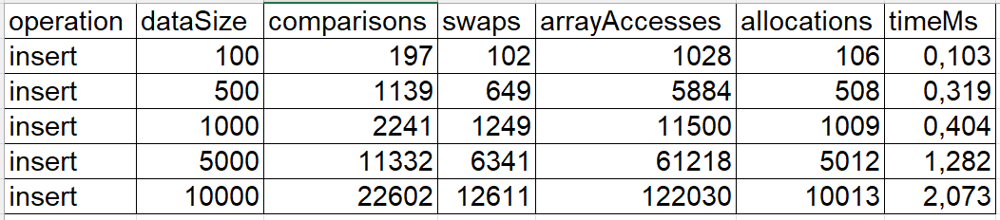

# DAA Assignment 2: Min-Heap Implementation & Analysis

**Student A**: Nurdaulet Saparbekov
**Pair Assignment**: Pair 4 - Min and Max Heap Analysis  
**Data Structure**: Min-Heap with `decreaseKey` and `merge` operations


## 🎯 Overview

This project implements a **Min-Heap** data structure in Java with support for:
- Standard heap operations (insert, extractMin, peekMin)
- **decreaseKey**: Update element value with O(log n) complexity
- **merge**: Combine two heaps efficiently in O(n) time
- Performance tracking and CSV export for empirical analysis

---

## ✨ Features

-  **Complete Min-Heap Implementation**
    - Dynamic resizing with doubling strategy
    - Handle-based element tracking for decreaseKey
    - Bottom-up heap construction for merge

-  **Performance Tracking**
    - Comparisons, swaps, array accesses, allocations
    - Time measurements in nanoseconds/milliseconds
    - CSV export for data analysis

-  **Comprehensive Testing**
    - 30+ JUnit test cases
    - Edge case coverage (empty, single element, large datasets)
    - Stress tests and performance validation

-  **Benchmarking Tools**
    - Interactive CLI benchmark runner
    - JMH micro-benchmarks for accurate measurements
    - Configurable input sizes

-  **CI/CD Pipeline**
    - GitHub Actions for automated testing
    - Maven build automation

---

## 📁 Project Structure

```
DAA-assignment2/
├── src/
│   ├── main/
│   │   └── java/org/harryfloppa/
│   │       ├── algorithms/
│   │       │   ├── IHeap.java               # Heap abstract class
│   │       │   ├── Heap.java               # Heap abstract class
│   │       │   ├── MinHeap.java            # Main implementation
│   │       ├── metrics/
│   │       │   └── PerformanceTracker.java # Metrics tracking
│   │       ├── cli/
│   │       └── BenchmarkRunner.java         # CLI tool
│   └── test/
│       └── java/org/harryfloppa/algorithms/
│           └── MinHeapTest.java             # JUnit tests
├── .github/
│   └── workflows/
│       └── maven.yml                        # CI configuration
├── pom.xml                                  # Maven dependencies
└── README.md
```

---

## 🚀 Installation

### Prerequisites
- Java 17 or higher
- Maven 3.6+
- Git

### Clone and Build

```bash
# Clone repository
git clone https://github.com/YOUR_USERNAME/DAA-assignment2.git
cd DAA-assignment2

# Build project
mvn clean install

# Run tests
mvn test
```

### 2. CLI Benchmark Runner

```bash
# Run interactive benchmark tool
mvn exec:java -Dexec.mainClass="org.harryfloppa.BenchmarkRunner"
```

**Menu Options:**
- Insert Benchmark
- ExtractMin Benchmark
- DecreaseKey Benchmark
- Merge Benchmark
- Run All Benchmarks
- Custom Size Testing

### 3. JMH Benchmarks

```bash
# Build benchmark JAR
mvn clean package

# Run JMH benchmarks
java -jar target/benchmarks.jar

```

---

## 📊 Complexity Analysis

### Theoretical Complexity

| Operation | Time Complexity | Space Complexity |
|-----------|----------------|------------------|
| **insert** | O(log n) | O(1) amortized |
| **extractMin** | O(log n) | O(1) |
| **peekMin** | O(1) | O(1) |
| **decreaseKey** | O(log n) | O(1) |
| **merge** | O(n₁ + n₂) | O(n₁ + n₂) |

### Implementation Details

#### Insert Operation
- **Best Case**: O(1) - element inserted at bottom stays there
- **Average Case**: O(log n) - bubbles up partway
- **Worst Case**: O(log n) - bubbles to root
- Amortized O(1) for array resizing with doubling

#### ExtractMin Operation
- Always O(log n) - swap with last, remove, sift down
- Height of tree is ⌊log₂ n⌋

#### DecreaseKey Operation
- O(1) handle lookup via HashMap
- O(log n) sift-up after value decrease
- Critical for Dijkstra's algorithm optimization

#### Merge Operation
- O(n₁ + n₂) using Floyd's buildHeap algorithm
- Bottom-up construction is faster than n insertions
- No handle reuse to avoid conflicts

### Empirical Verification

Run benchmarks to verify:
```bash
mvn exec:java -Dexec.mainClass="org.harryfloppa.BenchmarkRunner"
# Select option 5: Run All Benchmarks
```

Results exported to `benchmark-results.csv` for analysis.

---

## 🧪 Testing

### Run All Tests

```bash
mvn test
```

### Test Coverage

- **Basic Operations**: insert, extract, peek
- **Advanced Operations**: decreaseKey, merge
- **Edge Cases**:
    - Empty heap
    - Single element
    - Duplicate values
    - Large datasets (10,000+ elements)
    - Integer limits (MIN_VALUE, MAX_VALUE)
- **Performance Tests**: Metrics validation and CSV export
---

## 🔄 CI/CD

### GitHub Actions Workflow

Automated testing on every push/PR:

```yaml
- Build with Maven
- Run all tests
- Generate test reports
```

**View Status**: Check "Actions" tab in your GitHub repository

---

## 📈 Results

### Sample Benchmark Results (Insert Operation)



**Analysis**:
- Time complexity matches O(n log n) for n insertions
- Comparisons scale as expected with heap height
- Memory allocations minimal due to doubling strategy

---

**Last Updated**: October 2025